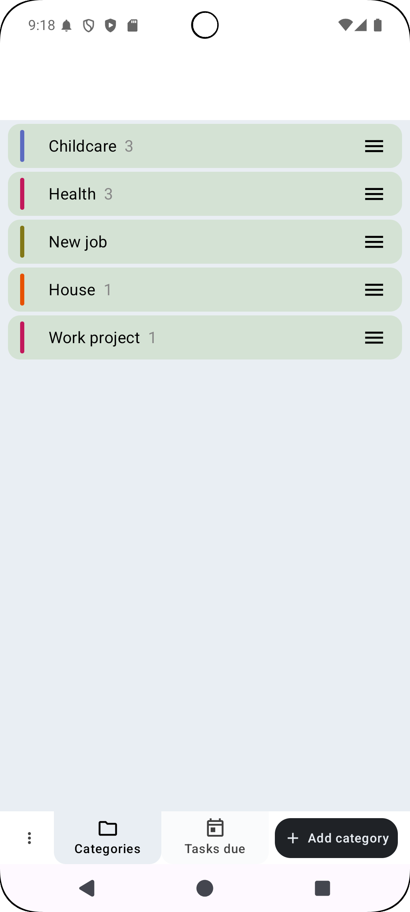
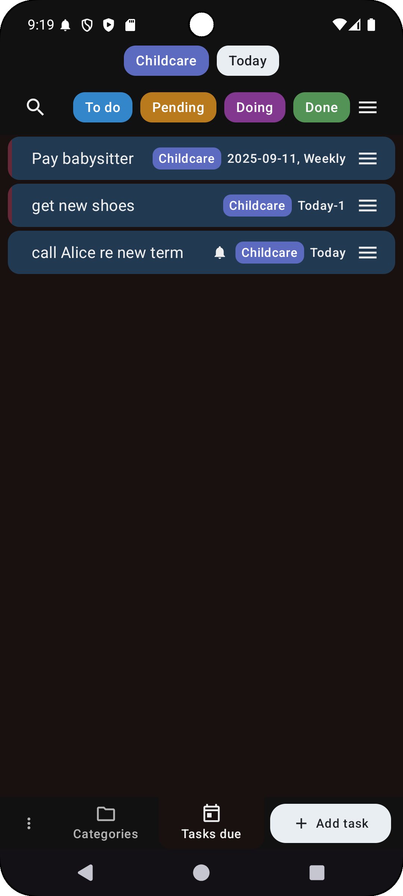

# Tasks app with reminders and categories  

Add due dates, set repeats, and keep tasks organised.
No ads. No tracking. No data sharing. Your tasks stay on your device.

---

## Features

### Privacy and control
- 100% free and open source, with no hidden catches.  
- No ads and no data sharing, everything stays local.  
- Requires no permissions (only if you want notifications).  
- Option to encrypt Google backups, so your data stays private if you change or restore your phone.  
- Manual backup and restore for full control.  

### Task management
- Add due dates, make tasks recurrent, and trigger notifications.  
- Organise tasks into categories.  
- Filter and search by category, due date, status, or text.  
- Archive completed tasks to reduce clutter.  

### Clean design
- Simple, distraction-free interface.  
- Built-in dark mode.  
- Adjustable text size for comfort.  
- Works on phones and tablets.  

---

## Screenshots

| Task list | Categories | Add task | Dark mode |
|-----------|------------|----------|-----------|
|  |  |  |  |

---

## Get the app

- [Latest GitHub release](https://github.com/app-muon/AndroidTaskFree/releases)  
- Available on [Google Play](https://play.google.com/store/apps/details?id=com.taskfree.app)  

---

## About

TaskFree can be used as a to-do list, a planner, or a reminder app.  
It is free, open source, and designed to keep your data private.  

No ads. No tracking. Just a simple way to manage tasks on your phone or tablet.  

[Source code on GitHub](https://github.com/app-muon/AndroidTaskFree)
